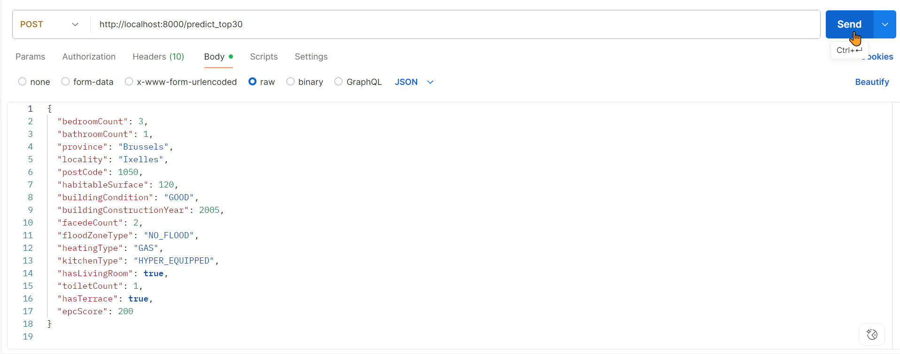

# Prerequisites

Make sure **Python 3.12.10** is installed.

- [Download Python 3.12.10](https://www.python.org/downloads/release/python-31210/)
- Add Python to your system `PATH`

> ⚠️ This project is validated under Python 3.12.10. Other versions may result in compatibility issues.

# Real Estate Data Analysis & Price Predictor

A modular and extensible project for predicting real estate prices across multiple cities and model types.  
Compatible with both **local environments** and **Databricks** (MLflow, DBFS, Delta).


## Environment Setup

Use the virtual environment to manage dependencies cleanly:

```bash
chmod +x setup-env.sh
./setup-env.sh
```


##  Project Structure

```text

real-estate-price-predictor/
├── configs/                         # YAML configuration files (e.g. column mapping)
│   └── feature_mapping.yaml         # Mapping of column variants to standard names
│
├── data/                            # Input CSV datasets
│   ├── cleaned/                     # Cleaned datasets ready for modeling
│   ├── ml_ready/                    # ML-ready final datasets
│   ├── raw/                         # Original raw exports
│   └── outputs/                     # Any intermediate or test outputs
│
├── database/                        # SQLite database storage for evaluation and cleaning logs
│   └── metrics.db                   # Centralized database for model metrics and data cleaning versions
│
├── dbfs_models/                     # Output directory for models if using Databricks
│
├── local_models/                    # Trained models stored locally
│   ├── rf/                          # Random Forest models by dataset
│   ├── lgbm/                        # LightGBM models by dataset
│   └── lr/                          # Linear Regression models by dataset
│
├── ml_models/                       # Core machine learning model definitions
│   ├── __init__.py                  # Makes this a Python package
│   ├── base_model.py                # Abstract base class for model interfaces
│   ├── rf_model.py                  # Random Forest implementation
│   ├── lgbm_model.py                # LightGBM implementation (Distributed Gradient Boosting Machine)
│   ├── lr_model.py                  # Linear Regression implementation
│   └── model_factory.py             # Factory to retrieve the correct model class
│
├── notebooks/                       # Jupyter notebooks for exploration and training
│   ├── exploration/                 # Notebooks for EDA per source
│   └── pipeline/                    # Modular notebooks (cleaning, training, tuning, export,etc.)
│       ├── 00_setup_env.ipynb           # Setup virtual environment and dependencies
│       ├── 01_exploration.ipynb         # Data exploration and inspection
│       ├── 02_preprocessing.ipynb       # Data cleaning and feature engineering
│       ├── 03_train_model.ipynb         # Training individual models
│       ├── 04_evaluate_model.ipynb      # Evaluation metrics and visualizations
│       ├── 05_register_model.ipynb      # Optional model registry logic
│       └── 06_batch_train_all.ipynb     # Loop training over all datasets
│
├── scripts/                         # Executable Python scripts
│   ├── train_all_datasets.py        # Main script to train all models for all datasets
│   ├── train_all_datasets.sh        # Bash script to launch training from terminal
│   ├── train_and_register.py        # Alternate script to train and register models
│   └── train_and_register.sh        # Bash wrapper for above
│
├── tests/                           # Unit tests
│   ├── __init__.py                  # Init file for test package
│   └── test_model_training.py       # Basic test for training pipeline
│
├── utils/                           # Utility scripts and helpers
│   ├── column_mapper.py             # Logic to standardize columns across datasets
│   ├── constants.py                 # Global constants (e.g., target column)
│   ├── logger.py                    # Logging utilities
│   ├── paths.py                     # Helper functions for path management
│   ├── model_evaluator.py           # Centralized logic to log model evaluations (MAE, RMSE, R<sup>2</sup>) to SQLite
│   ├── data_cleaner.py              # Cleans data and logs decisions (outliers, filters, price range, etc.)
│   └── preprocessing.py             # Custom preprocessing functions
│
├── .gitignore                       # Git ignored files list
├── README.md                        # Project overview and documentation
├── requirements.txt                 # Python package dependencies
└── setup-env.sh                     # Script to initialize virtual environment


real-estate-price-predictor/
├── configs/                         # YAML configuration files (e.g. column mapping)
│   └── feature_mapping.yaml         # Mapping of column variants to standard names
│
├── data/                            # Input CSV datasets
│   └── immovlan_real_estate.csv     # Sample real estate dataset
│
├── dbfs_models/                     # Output directory for models if using Databricks
│
├── local_models/                    # Trained models stored locally
│   ├── rf/                          # Random Forest models by dataset
│   ├── lgbm/                        # LightGBM models by dataset
│   └── lr/                          # Linear Regression models by dataset
│
├── ml_models/                       # Core machine learning model definitions
│   ├── __init__.py                  # Makes this a Python package
│   ├── base_model.py                # Abstract base class for model interfaces
│   ├── rf_model.py                  # Random Forest implementation
│   ├── lgbm_model.py                # LightGBM implementation (Distributed Gradient Boosting Machine)
│   ├── lr_model.py                  # Linear Regression implementation
│   └── model_factory.py             # Factory to retrieve the correct model class
│
├── notebooks/                       # Jupyter notebooks for exploration and training
│   ├── 00_setup_env.ipynb           # Setup virtual environment and dependencies
│   ├── 01_exploration.ipynb         # Data exploration and inspection
│   ├── 02_preprocessing.ipynb       # Data cleaning and feature engineering
│   ├── 03_train_model.ipynb         # Training individual models
│   ├── 04_evaluate_model.ipynb      # Evaluation metrics and visualizations
│   ├── 05_register_model.ipynb      # Optional model registry logic
│   └── 06_batch_train_all.ipynb     # Loop training over all datasets
│
├── scripts/                         # Executable Python scripts
│   ├── train_all_datasets.py        # Main script to train all models for all datasets
│   ├── train_all_datasets.sh        # Bash script to launch training from terminal
│   ├── train_and_register.py        # Alternate script to train and register models
│   └── train_and_register.sh        # Bash wrapper for above
│
├── tests/                           # Unit tests
│   ├── __init__.py                  # Init file for test package
│   └── test_model_training.py       # Basic test for training pipeline
│
├── utils/                           # Utility scripts and helpers
│   ├── column_mapper.py             # Logic to standardize columns across datasets
│   ├── constants.py                 # Global constants (e.g., target column)
│   ├── logger.py                    # Logging utilities
│   ├── paths.py                     # Helper functions for path management
│   └── preprocessing.py             # Custom preprocessing functions
│
├── .gitignore                       # Git ignored files list
├── README.md                        # Project overview and documentation
├── requirements.txt                 # Python package dependencies
└── setup-env.sh                     # Script to initialize virtual environment
```

# Real Estate Price Prediction Pipeline (CatBoost, XGBoost, Linear Models)

## Overview

This repository presents a complete end-to-end machine learning pipeline for real estate price prediction, built on the following stages:

- Data cleaning and visualization  
- Feature engineering and preprocessing  
- Model training (Linear, Random Forest, XGBoost, CatBoost)  
- Hyperparameter tuning with Optuna  
- Evaluation and metrics analysis  
- Inference on new data  

It follows a modular, reusable, and testable design to ensure robustness, interpretability, and deployment readiness.

## Folder Structure

```
notebooks/
│ ├── 000_prestudy_model_comparison.ipynb
│ ├── 010_data_load_clean.ipynb
│ ├── 020_visualization_clean_for_ml.ipynb
│ ├── 030_preprocessing.ipynb
│ ├── 040_train_baseline_model.ipynb
│ ├── 050_tune_xgboost.ipynb
│ ├── 060_tune_catboost.ipynb
│ ├── 070_evaluation.ipynb
│ ├── 080_inference.ipynb
```

## Models Used

Both models were trained using **CatBoost** with **Optuna hyperparameter tuning** and saved using `joblib`.

These models are located in:

```
app/backend/models/pkl/
├── catboost_optuna_all_{date_time}.pkl
└── catboost_optuna_top30_{date_time}.pkl<sup>2</sup>
```

## Model Exploration and Tuning
### Models Compared
- Linear Regression
- Polynomial Regression (Degree 2)
- Random Forest
- XGBoost (baseline and tuned with Optuna)
- CatBoost (baseline and tuned with Optuna)
Each model was evaluated and compared using cross-validation.

  


 Train/Test Strategy & Feature Selection

## Train/Test Strategy

We followed a consistent train/test approach across all models to ensure fair evaluation and comparability:

- **Train/Test Split (80/20)** was applied for all models.  
  80% of the data was used for training, and 20% was held out as the final test set.

- For **XGBoost** and **CatBoost**, **5-Fold Cross Validation** was performed on the training set to tune hyperparameters (no separate validation set).

- The **test set remained untouched** during training and tuning. It was only used for final model evaluation.

- In **test/debug mode**, we reduced:
  - The number of folds (e.g., from 5 to 2),
  - The size of the training data sample,  
  → to **speed up Optuna hyperparameter tuning** without compromising the logic.

## Feature Selection Strategy

We applied a two-step strategy to reduce feature dimensionality and increase model interpretability:

- The initial feature set was **reduced by removing low-variance features**, using a **Variance Threshold** method. These features did not contribute meaningful information.

- We then selected the **top 30 features** using **Random Forest feature importance**, which ranked variables based on their predictive power.

- All models were trained and evaluated using two configurations:
  - **Full reduced feature set** (after removing low-variance features)
  - **Top 30 features only** (subset selected via importance)

### Why Two Feature Sets?

- To compare model robustness across feature subsets.
- To assess whether a smaller, more meaningful subset could maintain similar performance.
- To prioritize **model simplicity, speed, and generalization**.

# Model Benchmark Results – Interpretation & Insights

## Overview

This table presents a comprehensive comparison of several regression models trained on real estate data. The evaluation is based on:

- **Train/Test performance metrics**: MAE (Mean Absolute Error), RMSE (Root Mean Squared Error), R<sup>2</sup>
- **Generalization gap (r2_gap)**: Difference between training and testing R<sup>2</sup> scores
- **Diagnostic labels**: Qualitative interpretation of generalization (from "Excellent" to "Strong overfitting")
- **Number of features**: Indicates model complexity and dimensionality


## Top Performing Models

### Rank 1: CatBoost + Optuna CV (All Features – Post-Split Evaluation)
- **MAE Test**: 61.2 k&euro;
- **R<sup>2</sup> Test**: 0.809
- **r2_gap**: 0.109 → *Moderate Overfitting*
- **Features**: 72
- **Interpretation**:  
  This model offers the best balance between accuracy and robustness. Although the `r2_gap` is not negligible, it remains within acceptable bounds. The post-split evaluation approach reinforces reliability, avoiding test leakage. This is our **reference model**.

### Rank 2–3: CatBoost + Optuna CV (Top RF Features)
- Slightly lower R<sup>2</sup> test scores (0.803 and 0.799), with fewer features (30–71), and **lower overfitting**.  
- **Conclusion**: These models are more efficient (lighter input set), and maintain excellent performance – ideal for production scenarios prioritizing **speed** and **interpretability**.


## Generalization Trade-Off

Models in ranks **4 to 8** (XGBoost + Optuna variants) exhibit:

- **Good generalization** (r2_gap ~0.07–0.08)
- Slightly **lower test R<sup>2</sup> scores** (0.79–0.80)
- A more balanced bias-variance tradeoff
- **Top 30 features** are often sufficient, showcasing strong performance with simpler input spaces.

> These XGBoost models offer valuable alternatives when CatBoost is not preferred, or when early stopping (ES) improves convergence speed.


## Strong Generalizers

- **Rank 9–10**: Vanilla CatBoost with no Optuna tuning
  - **Zero r2_gap**, meaning training and test performances are identical.
  - However, **test R<sup>2</sup> remains below 0.79**, which limits predictive power.
  - **Use Case**: When stability/generalization outweigh accuracy.

- **Rank 16**: Linear Regression (All Features – CV 5-Fold)
  - Also shows **excellent generalization** with near-zero r2_gap.
  - Yet, accuracy is significantly lower (R<sup>2</sup> test = 0.670), suggesting **underfitting** and limited non-linearity capture.


## Overfitting & Model Limitations

- **Rank 13: Random Forest (All Features)**:
  - Very high training R<sup>2</sup> (0.965), but test R<sup>2</sup> = 0.764.
  - **r2_gap = 0.20 → Strong Overfitting**
  - Model fails to generalize despite high training accuracy.

- **Ranks 11–12**: XGBoost CV (All Features, Top RF)
  - Slight improvement in accuracy (test R<sup>2</sup> ~0.77), but still shows **moderate overfitting**.
  - Suggests fine-tuning alone isn't enough to control variance.


## Final Recommendations

| Use Case                            | Recommended Model                                             |
|------------------------------------|---------------------------------------------------------------|
| **Best overall performance**       | CatBoost + Optuna CV (All Features – Post-Split)             |
| **Lightweight, interpretable**     | CatBoost + Optuna CV (Top 30 Features)                       |
| **Robust generalization**          | CatBoost without tuning OR XGBoost + Early Stopping          |
| **Baseline comparison**            | Linear Regression (Degree 1 or 2)                            |
| **Avoid due to overfitting**       | Random Forest, overly complex untuned models                 |

---

## Final Note

Model selection is not only about best performance (R<sup>2</sup> or RMSE), but also about **generalization**, **feature simplicity**, and **robustness under change**.  
This benchmark highlights the value of **Optuna-tuned CatBoost**, but also warns against blindly trusting overly optimistic training metrics.


  


#  Real Estate Price Prediction API

## What does the API do?

- Loads two trained **CatBoost** models (`.pkl`) at startup:
  - `catboost_optuna_all_*.pkl`: trained with **all engineered features**
  - `catboost_optuna_top30_*.pkl`: trained with **top 30 features only**
- Provides two **POST endpoints** to make predictions based on input data
- Returns the predicted price as a JSON response


  


## Run the API explostion the model for real estate price prediction

From the root of the project, start the FastAPI server using:

```bash
./run-backend-api.sh
```
  

  


## API Endpoints

### Swagger UI

You can explore and test the API interactively via Swagger:  
`http://localhost:8000/docs`

  

  


## Test the API with Postman

### What we can do with Postman:
- Send **POST**, **GET**, etc. requests to your FastAPI endpoints
- Easily test `/predict_all` or `/predict_top30`
- View the **JSON response** returned by the real estate model
- Manage **headers**, **authentication**, and **JSON bodies** effortlessly
- Save request collections for future testing

### Installation
Download here: [https://www.postman.com/downloads/](https://www.postman.com/downloads/)


### Example test in Postman (for `/predict_top30`)

1. Open **Postman**  
2. Select request type: `POST`  
3. URL: `http://localhost:8000/predict_top30`  
4. Go to the `Headers` tab and add:
   - **Key**: `Content-Type`  
   - **Value**: `application/json`  
5. Go to the `Body` tab:
   - Choose `raw` and select `JSON` as the format
   - Paste the following example payload (simplified):


```json
{
  "habitableSurface": 120,
  "bathroomCount": 2,
  "postCode": 1000,
  "toiletCount": 2,
  "buildingConstructionYear": 2005,
  "locality_Knokke_Heist": 0,
  "building_age": 19,
  "surface_per_room": 30,
  "facedeCount": 2,
  "kitchenType_HYPER_EQUIPPED": 1,
  "buildingCondition_AS_NEW": 0,
  "province_West_Flanders": 0,
  "subtype_VILLA": 0,
  "subtype_HOUSE": 1,
  "province_Hainaut": 0,
  "room_count": 4,
  "bedroomCount": 3,
  "buildingCondition_TO_RENOVATE": 0,
  "epcScore_B": 1,
  "hasTerrace": 1,
  "subtype_PENTHOUSE": 0,
  "epcScore_C": 0,
  "buildingCondition_GOOD": 1,
  "heatingType_nan": 0,
  "hasLivingRoom": 1,
  "locality_Ixelles": 0,
  "kitchenType_INSTALLED": 0,
  "epcScore_A": 0,
  "epcScore_F": 0,
  "locality_Gent": 0
}
```
  
 

  


### Example test in Postman (for `/predict_all`)

```json
{
  "bedroomCount": 3,
  "bathroomCount": 2,
  "postCode": 1050,
  "habitableSurface": 100,
  "buildingConstructionYear": 2000,
  "facedeCount": 2,
  "toiletCount": 2,
  "room_count": 5,
  "surface_per_room": 20,
  "building_age": 24,
  "type_APARTMENT": 1,
  "type_HOUSE": 0,
  "subtype_APARTMENT": 1,
  "subtype_APARTMENT_BLOCK": 0,
  "subtype_DUPLEX": 0,
  "subtype_GROUND_FLOOR": 0,
  "subtype_HOUSE": 0,
  "subtype_MIXED_USE_BUILDING": 0,
  "subtype_PENTHOUSE": 0,
  "subtype_TOWN_HOUSE": 0,
  "subtype_VILLA": 0,
  "province_Antwerp": 0,
  "province_Brussels": 1,
  "province_East_Flanders": 0,
  "province_Flemish_Brabant": 0,
  "province_Hainaut": 0,
  "province_Limburg": 0,
  "province_Liège": 0,
  "province_Luxembourg": 0,
  "province_Namur": 0,
  "province_Walloon_Brabant": 0,
  "province_West_Flanders": 0,
  "locality_Anderlecht": 0,
  "locality_Antwerpen": 0,
  "locality_Bruxelles": 1,
  "locality_Gent": 0,
  "locality_Ixelles": 0,
  "locality_Knokke_Heist": 0,
  "locality_Liège": 0,
  "locality_Uccle": 0,
  "buildingCondition_AS_NEW": 0,
  "buildingCondition_GOOD": 1,
  "buildingCondition_JUST_RENOVATED": 0,
  "buildingCondition_TO_BE_DONE_UP": 0,
  "buildingCondition_TO_RENOVATE": 0,
  "buildingCondition_nan": 0,
  "floodZoneType_NON_FLOOD_ZONE": 1,
  "floodZoneType_POSSIBLE_FLOOD_ZONE": 0,
  "floodZoneType_RECOGNIZED_FLOOD_ZONE": 0,
  "floodZoneType_nan": 0,
  "heatingType_ELECTRIC": 0,
  "heatingType_FUELOIL": 0,
  "heatingType_GAS": 1,
  "heatingType_PELLET": 0,
  "heatingType_nan": 0,
  "kitchenType_HYPER_EQUIPPED": 1,
  "kitchenType_INSTALLED": 0,
  "kitchenType_NOT_INSTALLED": 0,
  "kitchenType_SEMI_EQUIPPED": 0,
  "kitchenType_USA_HYPER_EQUIPPED": 0,
  "kitchenType_USA_INSTALLED": 0,
  "kitchenType_nan": 0,
  "epcScore_A": 0,
  "epcScore_A_": 0,
  "epcScore_B": 1,
  "epcScore_C": 0,
  "epcScore_D": 0,
  "epcScore_E": 0,
  "epcScore_F": 0,
  "epcScore_G": 0,
  "hasLivingRoom": 1,
  "hasTerrace": 1
}
```

# Streamlit Frontend – Feature Input Interface

## How to Launch the Frontend

The frontend is a Streamlit app located in the `app/frontend-streamlit/` directory.

We provide a convenient script to launch the frontend:

```bash
chmod +x run-frontend-streamlit.sh
./run-frontend-streamlit.sh
```
### Purpose of the Interface

It allows users to input features of a real estate property (e.g., *habitable surface*) and get two predictions:

- One using **all available features**
- One using only the **top 30 most important features** (selected by feature importance ranking

  

  

  

### Model Predictions Displayed

#### Left Box – "Prediction using all features"

- **Estimated Price (&euro;):** `351,146`
- This prediction is made using the **full feature set** available in the training dataset (e.g., `type`, `locality`, `surface`, `kitchenType`, `EPC`, etc.)

#### Right Box – "Prediction using top 30 features"

- **Estimated Price (&euro;):** `337,674`
- This model only uses the **top 30 features**, identified by feature importance (e.g., via `RandomForest`).

  

### What Happens in the Background

When you click **Predict**:
1. The Streamlit app collects the user input.
2. It sends **two separate API calls** to the backend:
   - One to `/predict_all`
   - One to `/predict_top30`
3. The backend uses **CatBoost models tuned with Optuna** trained with:
   - Full features (`predict_all`)
   - Top 30 features (`predict_top30`)
4. Results are returned as **JSON** and rendered in two columns.
  
# Docker Containers – Setup & Usage Guide

This project uses **Docker containers** to isolate and run the different components of the Real Estate Price Prediction app:

## What Do the Containers Do?

- **Backend container**  
  Runs the FastAPI server with trained **CatBoost + Optuna** models, listening on port `8000`.  
  It exposes two endpoints:
  - `/predict_all`: uses the full feature set.
  - `/predict_top30`: uses the top 30 features only.

- **Frontend container**  
  Runs the **Streamlit app** allowing the user to enter features, send requests to the backend, and visualize predictions.  
  It runs on port `8501`.


### Requirements – Docker Installation

Before using Docker, make sure it's installed:

1. **Download Docker Desktop** for Windows, Mac, or Linux:  
   https://www.docker.com/products/docker-desktop/

2. **Install it** and ensure Docker Engine is running (check the Docker icon in the system tray).

3. Open a terminal and verify installation:

```bash
docker --version
docker compose version
```
You should see a version like `Docker version 28.x.x`.

## How to Launch the Application (Frontend + Backend)

Use the following script to launch **both** the FastAPI backend and Streamlit frontend:

```bash
./launch-docker-compose.sh
```
  


This will:

- Build both containers (backend and frontend-streamlit)
- Launch them using the `docker-compose.yml` file
- Expose:
  - FastAPI backend at http://localhost:8000/docs
  - Streamlit frontend at http://localhost:8501

  

  


## Summary of Commands

| Task                             | Command                          |
|----------------------------------|----------------------------------|
| Launch both frontend and backend | `./launch-docker-compose.sh`     |
| Stop all containers              | `docker compose down`            |
| Check Docker version             | `docker --version`               |

## Note
Make sure Docker Desktop is running before launching any script.

