# Prerequisites

Make sure **Python 3.12.10** is installed.

- [Download Python 3.12.10](https://www.python.org/downloads/release/python-31210/)
- Add Python to your system `PATH`

> ⚠️ This project is validated under Python 3.12.10. Other versions may result in compatibility issues.

# Real Estate Data Analysis & Price Predictor

A modular and extensible project for predicting real estate prices across multiple cities and model types.  
Compatible with both **local environments** and **Databricks** (MLflow, DBFS, Delta).


## Environment Setup

Use the virtual environment to manage dependencies cleanly:

```bash
chmod +x setup-env.sh
./setup-env.sh
```


##  Project Structure

```text

real-estate-price-predictor/
│
├── app/                              # Application code for both backend and frontend
│ ├── backend/                        # FastAPI backend serving prediction endpoints
│ │ ├── main.py                       # Main FastAPI app with endpoints
│ │ ├── models/                       # Folder containing ML model files (.pkl)
│ │ ├── Dockerfile.dev                # Local development Dockerfile for API
│ │ └── Dockerfile.azure              # Production Dockerfile for deployment to Azure App Service
│ │
│ └── frontend-streamlit/             # Streamlit frontend UI
│ ├── streamlit_app.py                # Main Streamlit script
│ ├── input_features_converter.       # Converts UI inputs to model-ready format
│ ├── Dockerfile.dev                  # Local development Dockerfile for UI
│ └── Dockerfile.azure                # Azure-ready Dockerfile for UI deployment
│
├── cloud/                            # Cloud deployment scripts and configuration
│ ├── azure/                          # Azure-specific deployment
│ │ ├── azure_deploy_api.sh           # Shell script to deploy FastAPI backend to Azure
│ │ ├── azure_deploy_frontend.sh      # Shell script to deploy Streamlit frontend to Azure
│ │ └── docker-compose-azure.yml      # Optional multi-container Azure deployment (if needed)
│ ├── aws/                            # (Reserved) AWS deployment files
│ └── gcp/                            # (Reserved) GCP deployment files
│
├── configs/                          # Static configuration files
│ └── feature_mapping.yaml            # Manual mapping for categorical encodings
│
├── data/                             # All input and output data folders
│ ├── raw/                            # Raw unprocessed data
│ ├── cleaned/                        # Cleaned data after preprocessing
│ ├── ml_ready/                       # Final dataset ready for ML training
│ ├── ml_pre_study_metrics/           # Benchmark metrics from early model runs
│ └── model_train_test_logs/          # Logs and predictions from model training/evaluation

├── database/                         # SQLite database storage
│ └── metrics.db                      # Central DB storing cleaning logs + model evaluation │
│
├── deck/                             # Presentations or project slides (e.g. PPTX, PDFs)
├── environment/                      # Environment setup files (e.g. conda, Docker context)
├── images/                           # Visuals for UI, documentation, or README
├── local_models/                     # Saved model variants for testing
│
├── ml_models/                        # OOP-style custom model classes
│ ├── base_model.py                   # Abstract base class for all models
│ ├── model_factory.py                # Utility to load the correct model class dynamically
│ ├── rf_model.py                     # Random Forest implementation
│ ├── lgbm_model.py                   # LightGBM implementation
│ └── lr_model.                       # Linear regression model
│
├── models/                           # (Legacy or optional) alternate model storage
│
├── notebooks/                        # Jupyter Notebooks for experimentation and pipelines
│ ├── exploration/                    # EDA and hypothesis testing
│ ├── catboost_info/                  # Specific notebooks for CatBoost tuning
│ └── pipeline/                       # Modular pipeline notebooks
│ ├── 010_data_load_clean.ipynb       # Load + clean raw data
│ ├── 030_preprocessing.ipynb         # Feature engineering, encoding, and scaling
│ ├── 050_tune_xgboost.ipynb          # XGBoost + Optuna hyperparameter tuning
│ └── ...                             # More model notebooks (LightGBM, CatBoost, etc.)
│
├── scripts/                          # Python and Bash scripts for automation
│ ├── pipeline_runner.py              # Automates full ML pipeline
│ ├── predict_price.py                # Script for making price predictions from CLI
│ ├── train_all_datasets.py           # Train model across multiple city datasets
│ ├── submit_azure_job.py             # Submit training as a remote Azure ML job
│ └── .sh                             # Various helper bash scripts
│
├── tests/                            # Unit tests
│ └── test_model_training.py          # Unit tests for model training components
│
├── utils/                            # Utility modules and helper classes
│ ├── constants.py                    # Global constants (e.g. paths, test mode)
│ ├── data_cleaner.py                 # Cleaning logic and strategies
│ ├── data_loader.py                  # Load + preprocess data for models
│ ├── experiment_tracker.py           # Track experiment metadata or versions
│ ├── model_evaluator.py              # Evaluate model performance (MAE, RMSE, R<sup>2</sup>)
│ ├── model_saver.py                  # Save models and metrics
│ ├── model_visualizer.py             # SHAP, permutation importance, etc.
│ ├── column_mapper.py                # Manual feature mappings
│ └── preprocessing_pipeline.         # Full preprocessing pipeline logic
│
├── docker-compose.yml                # Compose file to run backend + frontend locally
├── launch-docker-compose-.sh         # Helper scripts to run Docker Compose locally or remotely
├── README.md                         # Project documentation and quickstart
└── requirements.txt                  # Python dependencies for whole project

```

# Real Estate Price Prediction Pipeline (CatBoost, XGBoost, Linear Models)

## Overview

This repository presents a complete end-to-end machine learning pipeline for real estate price prediction, built on the following stages:

- Data cleaning and visualization  
- Feature engineering and preprocessing  
- Model training (Linear, Random Forest, XGBoost, CatBoost)  
- Hyperparameter tuning with Optuna  
- Evaluation and metrics analysis  
- Inference on new data  

It follows a modular, reusable, and testable design to ensure robustness, interpretability, and deployment readiness.

## Folder Structure

```
notebooks/
│ ├── 000_prestudy_model_comparison.ipynb
│ ├── 010_data_load_clean.ipynb
│ ├── 020_visualization_clean_for_ml.ipynb
│ ├── 030_preprocessing.ipynb
│ ├── 040_train_baseline_model.ipynb
│ ├── 050_tune_xgboost.ipynb
│ ├── 060_tune_catboost.ipynb
│ ├── 070_evaluation.ipynb
│ ├── 080_inference.ipynb
```

## Models Used

Both models were trained using **CatBoost** with **Optuna hyperparameter tuning** and saved using `joblib`.

These models are located in:

```
app/backend/models/pkl/
├── catboost_optuna_all_{date_time}.pkl
└── catboost_optuna_top30_{date_time}.pkl
```

## Model Exploration and Tuning
### Models Compared
- Linear Regression
- Polynomial Regression (Degree 2)
- Random Forest
- XGBoost (baseline and tuned with Optuna)
- CatBoost (baseline and tuned with Optuna)
Each model was evaluated and compared using cross-validation.

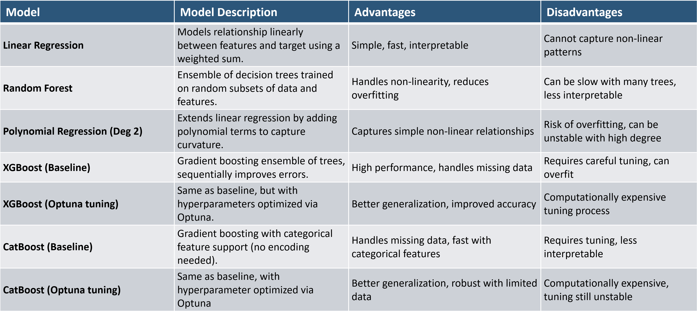  


 Train/Test Strategy & Feature Selection

## Train/Test Strategy

We followed a consistent train/test approach across all models to ensure fair evaluation and comparability:

- **Train/Test Split (80/20)** was applied for all models.  
  80% of the data was used for training, and 20% was held out as the final test set.

- For **XGBoost** and **CatBoost**, **5-Fold Cross Validation** was performed on the training set to tune hyperparameters (no separate validation set).

- The **test set remained untouched** during training and tuning. It was only used for final model evaluation.

- In **test/debug mode**, we reduced:
  - The number of folds (e.g., from 5 to 2),
  - The size of the training data sample,  
  → to **speed up Optuna hyperparameter tuning** without compromising the logic.

## Feature Selection Strategy

We applied a two-step strategy to reduce feature dimensionality and increase model interpretability:

- The initial feature set was **reduced by removing low-variance features**, using a **Variance Threshold** method. These features did not contribute meaningful information.

- We then selected the **top 30 features** using **Random Forest feature importance**, which ranked variables based on their predictive power.

- All models were trained and evaluated using two configurations:
  - **Full reduced feature set** (after removing low-variance features)
  - **Top 30 features only** (subset selected via importance)

### Why Two Feature Sets?

- To compare model robustness across feature subsets.
- To assess whether a smaller, more meaningful subset could maintain similar performance.
- To prioritize **model simplicity, speed, and generalization**.

# Model Benchmark Results – Interpretation & Insights

## Overview

This table presents a comprehensive comparison of several regression models trained on real estate data. The evaluation is based on:

- **Train/Test performance metrics**: MAE (Mean Absolute Error), RMSE (Root Mean Squared Error), R<sup>2</sup>
- **Generalization gap (r2_gap)**: Difference between training and testing R<sup>2</sup> scores
- **Diagnostic labels**: Qualitative interpretation of generalization (from "Excellent" to "Strong overfitting")
- **Number of features**: Indicates model complexity and dimensionality


## Top Performing Models

### Rank 1: CatBoost + Optuna CV (All Features – Post-Split Evaluation)
- **MAE Test**: 61.2 k&euro;
- **R<sup>2</sup> Train**: 0.918  
- **R<sup>2</sup> Test**: 0.809
- **r2_gap**: 0.109 → *Moderate Overfitting*
- **Features**: 72
- **Interpretation**:  
  This model offers the best balance between accuracy and robustness. Although the `r2_gap` is not negligible, it remains within acceptable bounds. The post-split evaluation approach reinforces reliability, avoiding test leakage. This is our **reference model**.

### Rank 2–3: CatBoost + Optuna CV (Top RF Features)
- Slightly lower R<sup>2</sup> test scores (0.803 and 0.799), with fewer features (30–71), and **lower overfitting**.  
- **Conclusion**: These models are more efficient (lighter input set), and maintain excellent performance – ideal for production scenarios prioritizing **speed** and **interpretability**.


## Generalization Trade-Off

Models in ranks **4 to 8** (XGBoost + Optuna variants) exhibit:

- **Good generalization** (r2_gap ~0.07–0.08)
- Slightly **lower test R<sup>2</sup> scores** (0.79–0.80)
- A more balanced bias-variance tradeoff
- **Top 30 features** are often sufficient, showcasing strong performance with simpler input spaces.

> These XGBoost models offer valuable alternatives when CatBoost is not preferred, or when early stopping (ES) improves convergence speed.


## Strong Generalizers

- **Rank 9–10**: Vanilla CatBoost with no Optuna tuning
  - **Zero r2_gap**, meaning training and test performances are identical.
  - However, **test R<sup>2</sup> remains below 0.79**, which limits predictive power.
  - **Use Case**: When stability/generalization outweigh accuracy.

- **Rank 16**: Linear Regression (All Features – CV 5-Fold)
  - Also shows **excellent generalization** with near-zero r2_gap.
  - Yet, accuracy is significantly lower (R<sup>2</sup> test = 0.670), suggesting **underfitting** and limited non-linearity capture.


## Overfitting & Model Limitations

- **Rank 13: Random Forest (All Features)**:
  - Very high training R<sup>2</sup> (0.965), but test R<sup>2</sup> = 0.764.
  - **r2_gap = 0.20 → Strong Overfitting**
  - Model fails to generalize despite high training accuracy.

- **Ranks 11–12**: XGBoost CV (All Features, Top RF)
  - Slight improvement in accuracy (test R<sup>2</sup> ~0.77), but still shows **moderate overfitting**.
  - Suggests fine-tuning alone isn't enough to control variance.


## Final Recommendations

| Use Case                            | Recommended Model                                             |
|------------------------------------|---------------------------------------------------------------|
| **Best overall performance**       | CatBoost + Optuna CV (All Features – Post-Split)             |
| **Lightweight, interpretable**     | CatBoost + Optuna CV (Top 30 Features)                       |
| **Robust generalization**          | CatBoost without tuning OR XGBoost + Early Stopping          |
| **Baseline comparison**            | Linear Regression (Degree 1 or 2)                            |
| **Avoid due to overfitting**       | Random Forest, overly complex untuned models                 |

---

## Final Note

Model selection is not only about best performance (R<sup>2</sup> or RMSE), but also about **generalization**, **feature simplicity**, and **robustness under change**.  
This benchmark highlights the value of **Optuna-tuned CatBoost**, but also warns against blindly trusting overly optimistic training metrics.


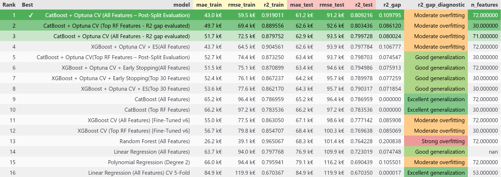  


#  Real Estate Price Prediction API (backend)

## What does the API do?

- Loads two trained **CatBoost** models (`.pkl`) at startup:
  - `catboost_optuna_all_*.pkl`: trained with **all engineered features**
  - `catboost_optuna_top30_*.pkl`: trained with **top 30 features only**
- Provides two **POST endpoints** to make predictions based on input data
- Returns the predicted price as a JSON response


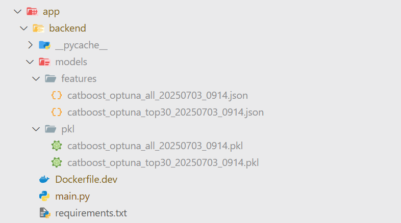  


## Run the API explostion the model for real estate price prediction

From the root of the project, start the FastAPI server using:

```bash
./run-backend-api.sh
```
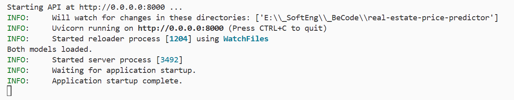  

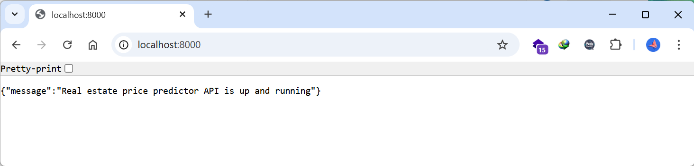  


## API Endpoints

### Swagger UI

You can explore and test the API interactively via Swagger:  
`http://localhost:8000/docs`

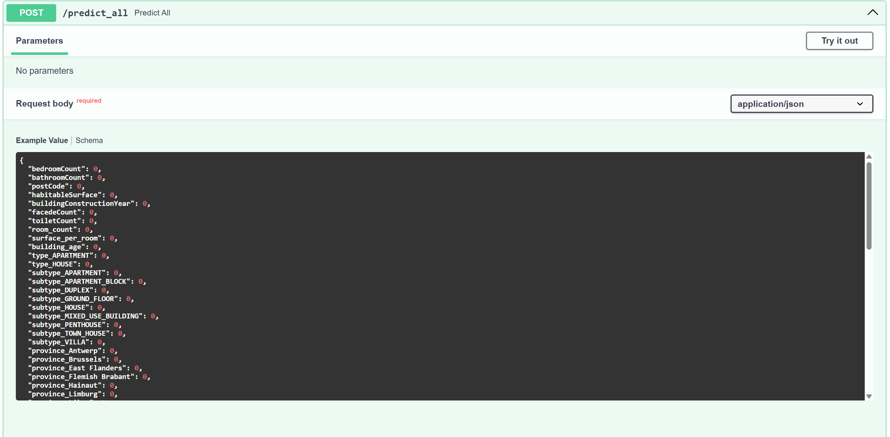  

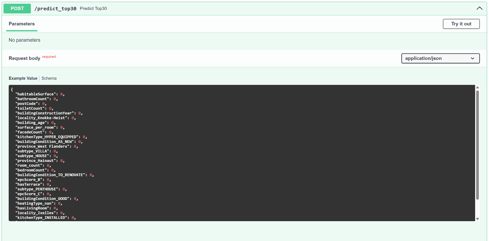  


## Test the API with Postman

### What we can do with Postman:
- Send **POST**, **GET**, etc. requests to your FastAPI endpoints
- Easily test `/predict_all` or `/predict_top30`
- View the **JSON response** returned by the real estate model
- Manage **headers**, **authentication**, and **JSON bodies** effortlessly
- Save request collections for future testing

### Installation
Download here: [https://www.postman.com/downloads/](https://www.postman.com/downloads/)


### Example test in Postman (for `/predict_top30`)

1. Open **Postman**  
2. Select request type: `POST`  
3. URL: `http://localhost:8000/predict_top30`  
4. Go to the `Headers` tab and add:
   - **Key**: `Content-Type`  
   - **Value**: `application/json`  
5. Go to the `Body` tab:
   - Choose `raw` and select `JSON` as the format
   - Paste the following example payload (simplified):


```json
{
  "habitableSurface": 120,
  "bathroomCount": 2,
  "postCode": 1000,
  "toiletCount": 2,
  "buildingConstructionYear": 2005,
  "locality_Knokke_Heist": 0,
  "building_age": 19,
  "surface_per_room": 30,
  "facedeCount": 2,
  "kitchenType_HYPER_EQUIPPED": 1,
  "buildingCondition_AS_NEW": 0,
  "province_West_Flanders": 0,
  "subtype_VILLA": 0,
  "subtype_HOUSE": 1,
  "province_Hainaut": 0,
  "room_count": 4,
  "bedroomCount": 3,
  "buildingCondition_TO_RENOVATE": 0,
  "epcScore_B": 1,
  "hasTerrace": 1,
  "subtype_PENTHOUSE": 0,
  "epcScore_C": 0,
  "buildingCondition_GOOD": 1,
  "heatingType_nan": 0,
  "hasLivingRoom": 1,
  "locality_Ixelles": 0,
  "kitchenType_INSTALLED": 0,
  "epcScore_A": 0,
  "epcScore_F": 0,
  "locality_Gent": 0
}
```

  

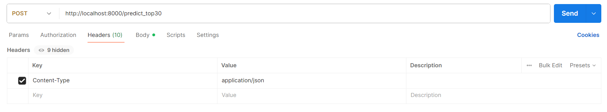  

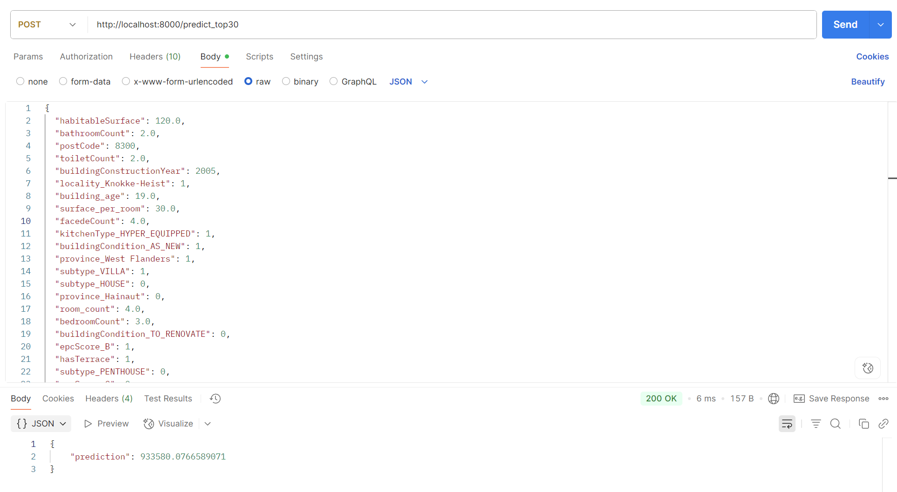  


### Example test in Postman (for `/predict_all`)

```json
{
  "bedroomCount": 3,
  "bathroomCount": 2,
  "postCode": 1050,
  "habitableSurface": 100,
  "buildingConstructionYear": 2000,
  "facedeCount": 2,
  "toiletCount": 2,
  "room_count": 5,
  "surface_per_room": 20,
  "building_age": 24,
  "type_APARTMENT": 1,
  "type_HOUSE": 0,
  "subtype_APARTMENT": 1,
  "subtype_APARTMENT_BLOCK": 0,
  "subtype_DUPLEX": 0,
  "subtype_GROUND_FLOOR": 0,
  "subtype_HOUSE": 0,
  "subtype_MIXED_USE_BUILDING": 0,
  "subtype_PENTHOUSE": 0,
  "subtype_TOWN_HOUSE": 0,
  "subtype_VILLA": 0,
  "province_Antwerp": 0,
  "province_Brussels": 1,
  "province_East_Flanders": 0,
  "province_Flemish_Brabant": 0,
  "province_Hainaut": 0,
  "province_Limburg": 0,
  "province_Liège": 0,
  "province_Luxembourg": 0,
  "province_Namur": 0,
  "province_Walloon_Brabant": 0,
  "province_West_Flanders": 0,
  "locality_Anderlecht": 0,
  "locality_Antwerpen": 0,
  "locality_Bruxelles": 1,
  "locality_Gent": 0,
  "locality_Ixelles": 0,
  "locality_Knokke_Heist": 0,
  "locality_Liège": 0,
  "locality_Uccle": 0,
  "buildingCondition_AS_NEW": 0,
  "buildingCondition_GOOD": 1,
  "buildingCondition_JUST_RENOVATED": 0,
  "buildingCondition_TO_BE_DONE_UP": 0,
  "buildingCondition_TO_RENOVATE": 0,
  "buildingCondition_nan": 0,
  "floodZoneType_NON_FLOOD_ZONE": 1,
  "floodZoneType_POSSIBLE_FLOOD_ZONE": 0,
  "floodZoneType_RECOGNIZED_FLOOD_ZONE": 0,
  "floodZoneType_nan": 0,
  "heatingType_ELECTRIC": 0,
  "heatingType_FUELOIL": 0,
  "heatingType_GAS": 1,
  "heatingType_PELLET": 0,
  "heatingType_nan": 0,
  "kitchenType_HYPER_EQUIPPED": 1,
  "kitchenType_INSTALLED": 0,
  "kitchenType_NOT_INSTALLED": 0,
  "kitchenType_SEMI_EQUIPPED": 0,
  "kitchenType_USA_HYPER_EQUIPPED": 0,
  "kitchenType_USA_INSTALLED": 0,
  "kitchenType_nan": 0,
  "epcScore_A": 0,
  "epcScore_A_": 0,
  "epcScore_B": 1,
  "epcScore_C": 0,
  "epcScore_D": 0,
  "epcScore_E": 0,
  "epcScore_F": 0,
  "epcScore_G": 0,
  "hasLivingRoom": 1,
  "hasTerrace": 1
}
```
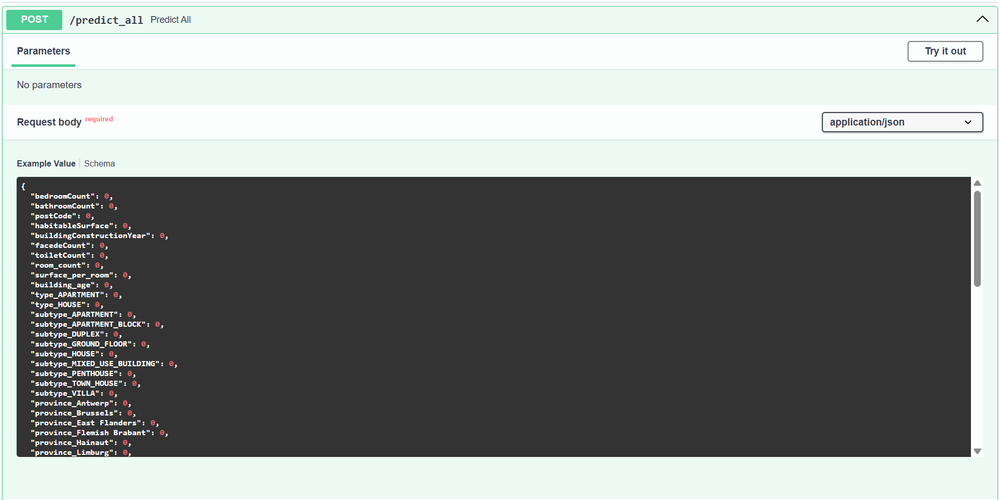  

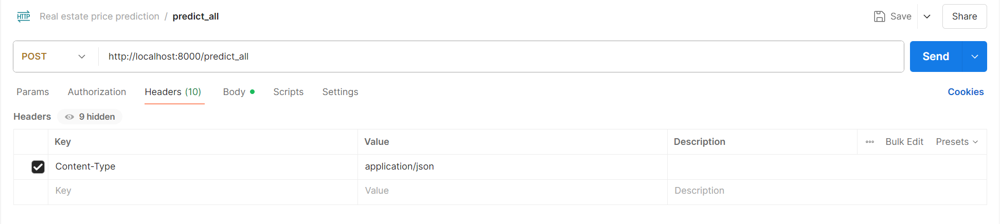  

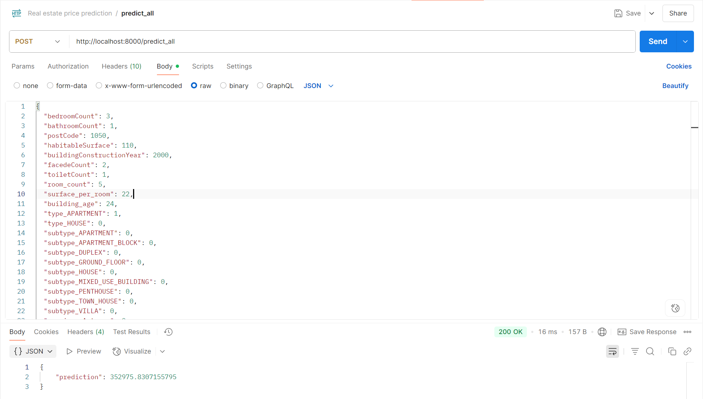 

# Streamlit Frontend – Feature Input Interface

## How to Launch the Frontend

The frontend is a Streamlit app located in the `app/frontend-streamlit/` directory.

We provide a convenient script to launch the frontend:

```bash
chmod +x run-frontend-streamlit.sh
./run-frontend-streamlit.sh
```
### Purpose of the Interface

It allows users to input features of a real estate property (e.g., *habitable surface*) and get two predictions:

- One using **all available features**
- One using only the **top 30 most important features** (selected by feature importance ranking

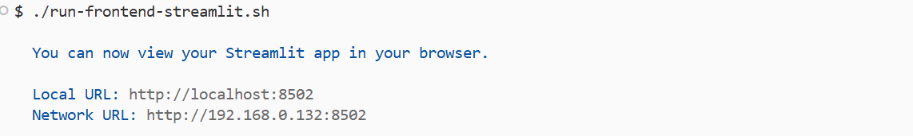  

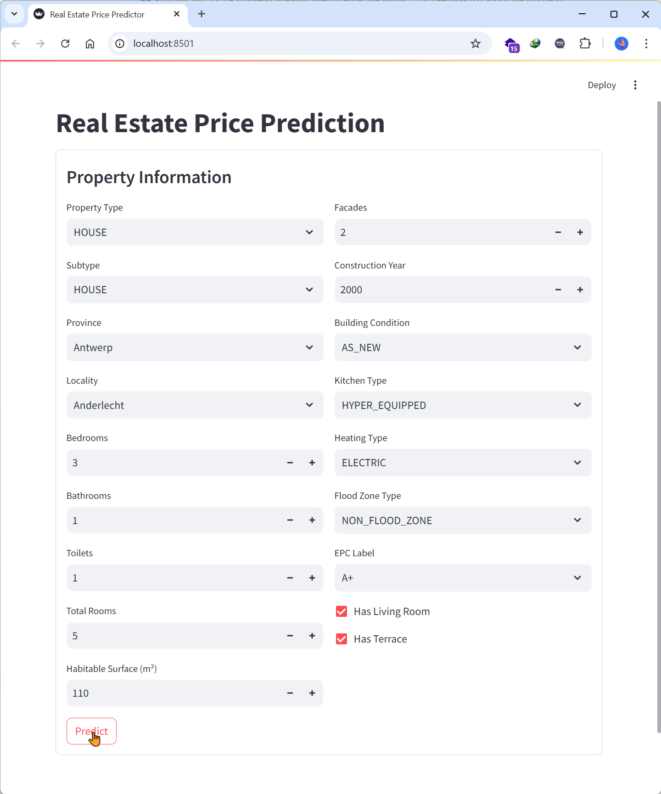  

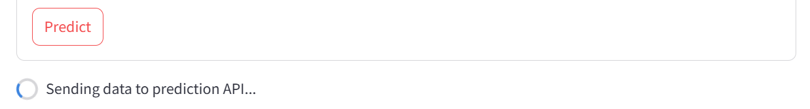  

### Model Predictions Displayed

#### Left Box – "Prediction using all features"

- **Estimated Price (&euro;):** `351 146`
- This prediction is made using the **full feature set** available in the training dataset (e.g., `type`, `locality`, `surface`, `kitchenType`, `EPC`, etc.)
- This model can capture complex interactions and patterns, potentially leading to higher accuracy.
- However, it may also suffer from overfitting, especially if noisy or redundant features are included.

#### Right Box – "Prediction using top 30 features"

- **Estimated Price (&euro;):** `337 674`
- This model only uses the **top 30 features**, identified by feature importance (e.g., via `RandomForest`).

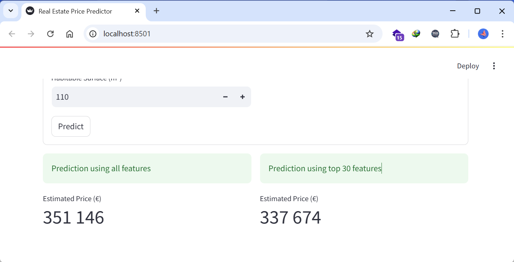  

- Irrelevant or low-impact features have been removed to improve generalization.
- This model is:
  - Faster and simpler
  - Less prone to overfitting
  - Slightly less accurate in some edge cases due to reduced information

### What Happens in the Background

When you click **Predict**:
1. The Streamlit app collects the user input.
2. It sends **two separate API calls** to the backend:
   - One to `/predict_all`
   - One to `/predict_top30`
3. The backend uses **CatBoost models tuned with Optuna** trained with:
   - Full features (`predict_all`)
   - Top 30 features (`predict_top30`)
4. Results are returned as **JSON** and rendered in two columns.
  
# Docker Containers – Setup & Usage Guide

This project uses **Docker containers** to isolate and run the different components of the Real Estate Price Prediction app:

## What Do the Containers Do?

- **Backend container**  
  Runs the FastAPI server with trained **CatBoost + Optuna** models, listening on port `8000`.  
  It exposes two endpoints:
  - `/predict_all`: uses the full feature set.
  - `/predict_top30`: uses the top 30 features only.

- **Frontend container**  
  Runs the **Streamlit app** allowing the user to enter features, send requests to the backend, and visualize predictions.  
  It runs on port `8501`.


### Requirements – Docker Installation

Before using Docker, make sure it's installed:

1. **Download Docker Desktop** for Windows, Mac, or Linux:  
   https://www.docker.com/products/docker-desktop/

2. **Install it** and ensure Docker Engine is running (check the Docker icon in the system tray).

3. Open a terminal and verify installation:

```bash
docker --version
docker compose version
```
You should see a version like `Docker version 28.x.x`.

## How to Launch the Application (Frontend + Backend)

Use the following script to launch **both** the FastAPI backend and Streamlit frontend:

```bash
./launch-docker-compose.sh
```
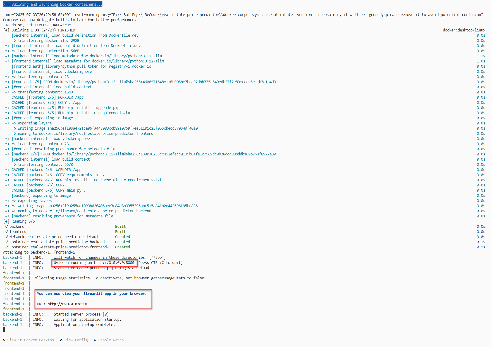  


This will:

- Build both containers (backend and frontend-streamlit)
- Launch them using the `docker-compose.yml` file
- Expose:
  - FastAPI backend at http://localhost:8000/docs
  - Streamlit frontend at http://localhost:8501

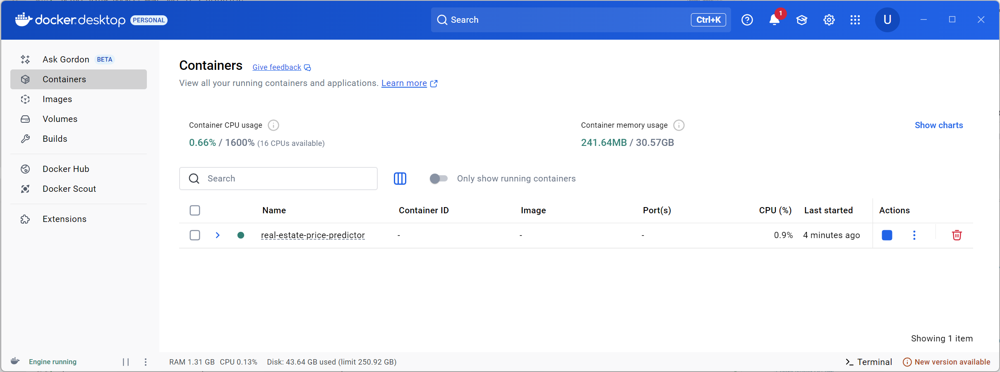  

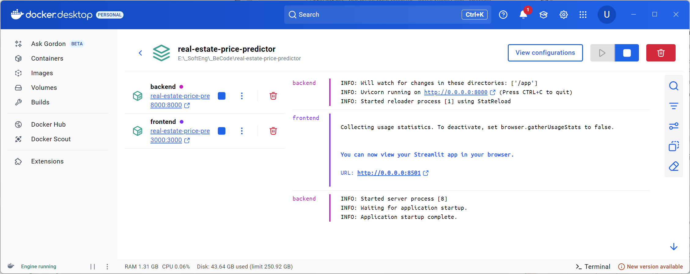  


## Summary of Commands

| Task                             | Command                          |
|----------------------------------|----------------------------------|
| Launch both frontend and backend | `./launch-docker-compose.sh`     |
| Stop all containers              | `docker compose down`            |
| Check Docker version             | `docker --version`               |

## Note
Make sure Docker Desktop is running before launching any script.


# Summary – API, Streamlit & Docker Integration

- **FastAPI backend** serves machine learning models (CatBoost) via two prediction endpoints: `/predict_all` and `/predict_top30`.
- **Streamlit frontend** provides a user-friendly web interface to input property features and display price predictions in real time.
- **Docker** containers encapsulate both backend and frontend for easy deployment and reproducibility.
- A shared **Docker network** ensures seamless communication between the API and the Streamlit app.
- Everything is orchestrated via `docker-compose`, allowing a single command to launch the full prediction stack locally or in the cloud.


# API Deployment on Azure (FastAPI)

The FastAPI backend is containerized using Docker and deployed to **Azure App Service** via the Azure CLI. It uses **Azure Container Registry (ACR)** to store the image and is hosted on a Linux App Service instance.

## Public URLs

- **API Base URL**: [https://realestate-api.azurewebsites.net](https://realestate-api.azurewebsites.net)
- **API Docs (Swagger UI)**: [https://realestate-api.azurewebsites.net/docs](https://realestate-api.azurewebsites.net/docs)

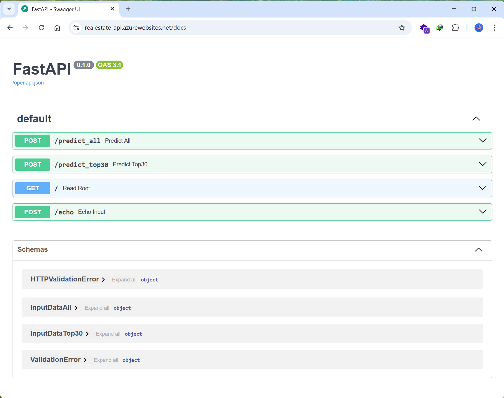  

## Deployment Overview

- The backend is served with **Uvicorn** on port `8000`.
- The Docker image is built locally, then **pushed to ACR**.
- An **App Service for Linux** is configured to pull the image from ACR.
- The deployment is fully automated via a shell script: `cloud/azure/azure_deploy_api.sh`

## How to Deploy the API

To deploy from your local machine, launch next the API deployment script:

```bash
./cloud/azure/azure_deploy_api.sh
```


## API Deployment Script – Step-by-Step

This script performs the following steps:

### 1. Login to Azure via CLI

```bash
az login
```

### 2. Set environment variables (e.g., resource group, ACR name, app name)

```bash
RESOURCE_GROUP=my-rg
ACR_NAME=myacr
APP_NAME=realestate-api
```

### 3. Build the Docker image locally

```bash
docker build -t $ACR_NAME.azurecr.io/$APP_NAME:latest ./app/backend
```

### 4. Login to Azure Container Registry (ACR)

```bash
az acr login --name $ACR_NAME
```

### 5. Push the image to ACR

```bash
docker push $ACR_NAME.azurecr.io/$APP_NAME:latest
```

### 6. Create the Web App (if not already created)

```bash
az webapp create \
  --resource-group $RESOURCE_GROUP \
  --plan myAppServicePlan \
  --name $APP_NAME \
  --deployment-container-image-name $ACR_NAME.azurecr.io/$APP_NAME:latest
```

### 7. Configure App Service to pull from ACR

```bash
az webapp config container set \
  --name $APP_NAME \
  --resource-group $RESOURCE_GROUP \
  --docker-custom-image-name $ACR_NAME.azurecr.io/$APP_NAME:latest \
  --docker-registry-server-url https://$ACR_NAME.azurecr.io
```

### 8. Restart the app

```bash
az webapp restart --name $APP_NAME --resource-group $RESOURCE_GROUP
```

## Related Files

Located in `cloud/azure/`:

- `azure_deploy_api.sh` – Automates API deployment)  
- `azure_deploy_frontend.sh` – For Streamlit UI (see separate doc)  
- `docker-compose-azure.yml` – Optional multi-container deployment reference

## Result

After deployment, your FastAPI backend is live and ready to serve predictions via:

```bash
GET  https://realestate-api.azurewebsites.net/docs
POST https://realestate-api.azurewebsites.net/predict_all
POST https://realestate-api.azurewebsites.net/predict_top30
```

Make sure CORS settings are configured to allow frontend access if needed.

# API Deployment on Render

## Docker file 

```Dockerfile
FROM python:3.11-slim

# Install system dependencies for LightGBM
RUN apt-get update && apt-get install -y \
    build-essential \
    libgomp1 \
    && rm -rf /var/lib/apt/lists/*

# Set work directory
WORKDIR /app

# Copy source code
COPY . /app

# Install Python dependencies
RUN pip install --no-cache-dir -r requirements.txt

# Expose FastAPI port
EXPOSE 8000

# Start API
CMD ["uvicorn", "main:app", "--host", "0.0.0.0", "--port", "8000"]
```

## Configure deployment on Render
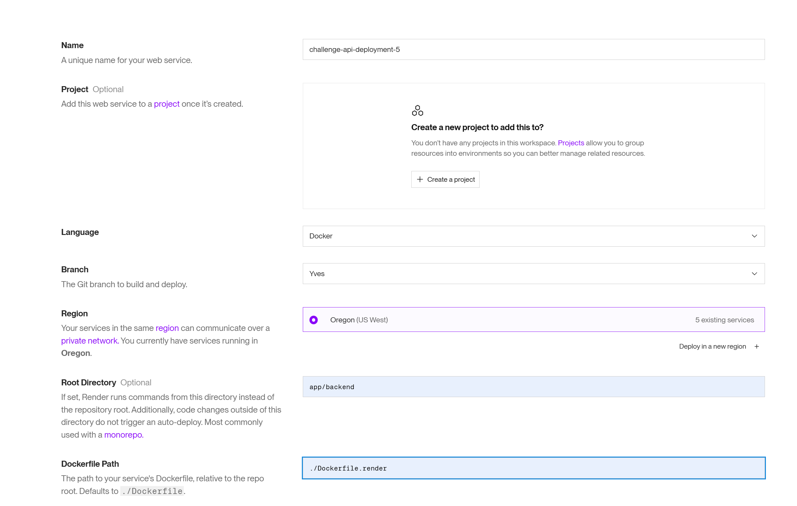  

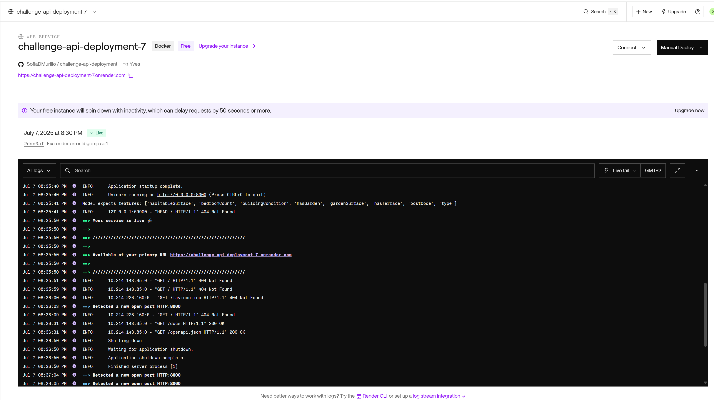  

# Frontend Deployment on Azure (Streamlit frontend)

The Streamlit frontend is containerized using Docker and deployed to Azure App Service via the Azure CLI. It uses Azure Container Registry (ACR) to store the image and is hosted on a Linux App Service instance.

## Public URL

Frontend URL:  
https://realestate-ui.azurewebsites.net

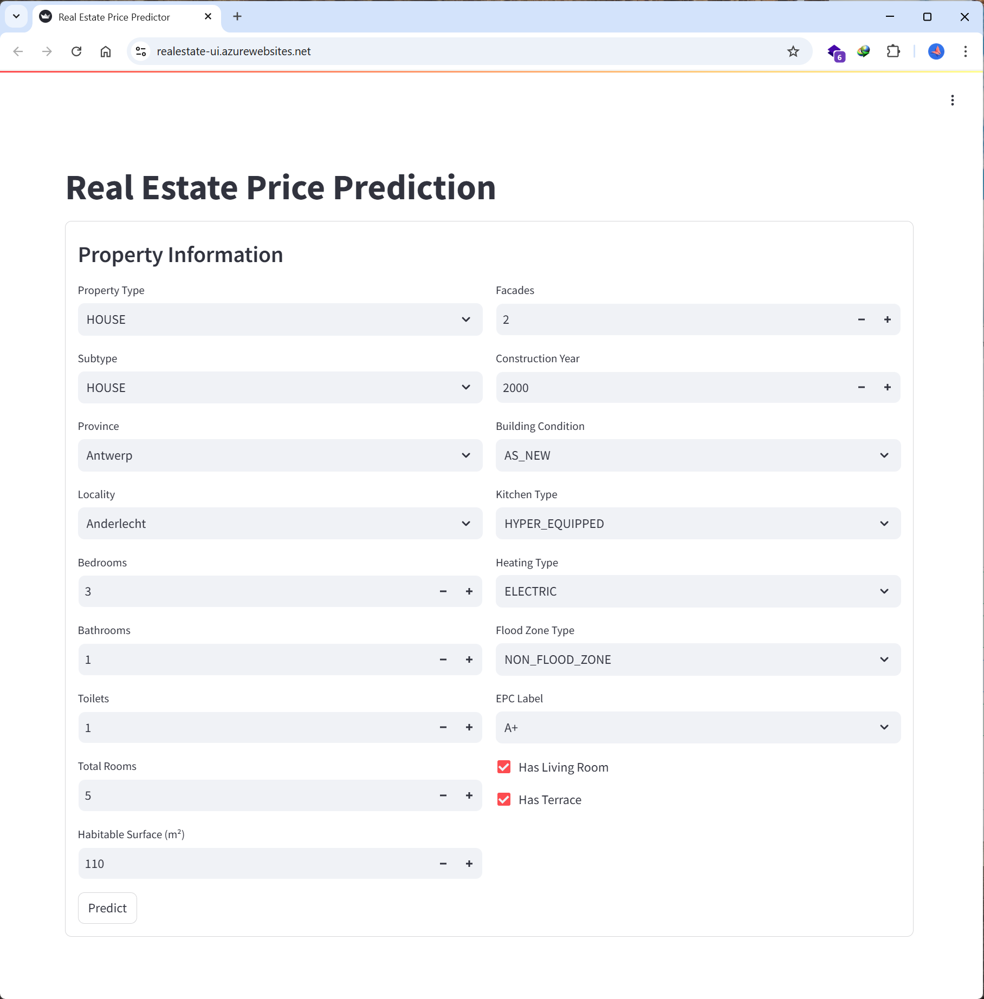  


## Deployment Overview

- The frontend is served with Streamlit on port `8501`.
- The Docker image is built locally, then pushed to ACR.
- An App Service for Linux is configured to pull the image from ACR.
- The deployment is fully automated via the shell script:  
  `cloud/azure/azure_deploy_frontend.sh`

## How to Deploy the Frontend

This script performs the following steps:

### 1. Login to Azure via CLI

```bash
az login
```

### 2. Set environment variables (e.g., resource group, ACR name, app name)

```bash
RESOURCE_GROUP=my-rg
ACR_NAME=myacr
APP_NAME=realestate-ui
```

### 3. Build the Docker image locally

```bash
docker build -t $ACR_NAME.azurecr.io/$APP_NAME:latest ./app/frontend-streamlit
```

### 4. Login to Azure Container Registry (ACR)

```bash
az acr login --name $ACR_NAME
```

### 5. Push the image to ACR

```bash
docker push $ACR_NAME.azurecr.io/$APP_NAME:latest
```

### 6. Create the Web App (if not already created)

```bash
az webapp create \
  --resource-group $RESOURCE_GROUP \
  --plan myAppServicePlan \
  --name $APP_NAME \
  --deployment-container-image-name $ACR_NAME.azurecr.io/$APP_NAME:latest
```

### 7. Configure App Service to pull from ACR

```bash
az webapp config container set \
  --name $APP_NAME \
  --resource-group $RESOURCE_GROUP \
  --docker-custom-image-name $ACR_NAME.azurecr.io/$APP_NAME:latest \
  --docker-registry-server-url https://$ACR_NAME.azurecr.io
```

### 8. Restart the app

```bash
az webapp restart --name $APP_NAME --resource-group $RESOURCE_GROUP
```

## Related Files

Located in `cloud/azure/`:

- `azure_deploy_frontend.sh` – Automates Streamlit UI deployment  
- `azure_deploy_api.sh` – For FastAPI backend deployment  
- `docker-compose-azure.yml` – Optional multi-container deployment reference

## Result

After deployment, your Streamlit frontend is publicly accessible at:

```bash
https://realestate-ui.azurewebsites.net
```

The frontend communicates with the backend API via HTTP POST requests, for example:

```python
API_URL = "https://realestate-api.azurewebsites.net/predict_all"
response = requests.post(API_URL, json=input_data)
```

Both the backend and frontend run in isolated Docker containers, each deployed as a separate **Azure Web App**. The Streamlit frontend uses `requests.post(...)` to call the FastAPI backend over HTTPS.

To allow these **cross-origin requests** between different domains (e.g. `realestate-ui.azurewebsites.net` → `realestate-api.azurewebsites.net`), the backend must include **CORS (Cross-Origin Resource Sharing)** settings. These are configured in the FastAPI app using `CORSMiddleware`.

## Azure Deployment Summary

This setup ensures a fully containerized deployment of both the **FastAPI backend** and the **Streamlit frontend** on **Azure App Service**, with container images hosted in **Azure Container Registry (ACR)**. 

Each component runs in isolation, is independently deployable, and can scale based on demand. Once **CORS** is properly configured on the backend, the frontend can securely communicate with the API over HTTPS, enabling real-time price predictions from any browser.

This cloud architecture is robust, production-ready, and easy to maintain, ideal for both development and operational use at scale.
